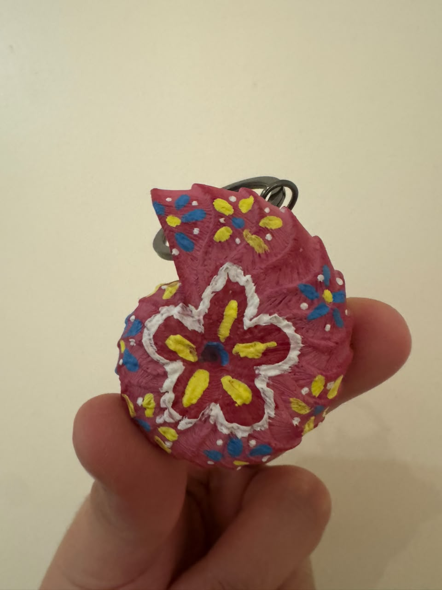
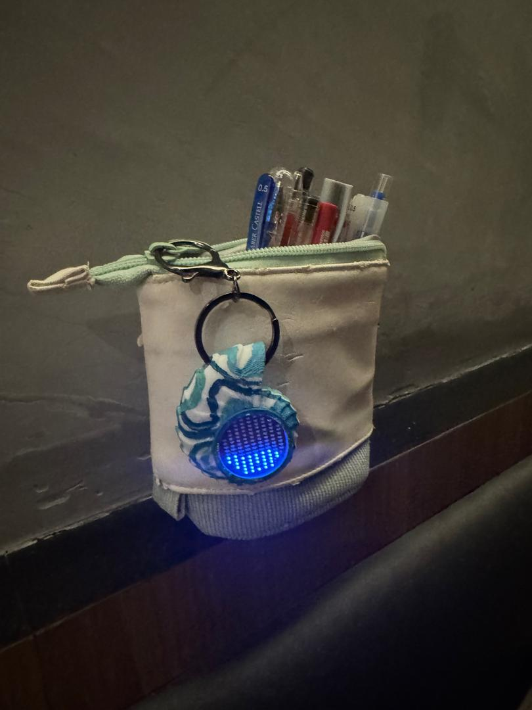
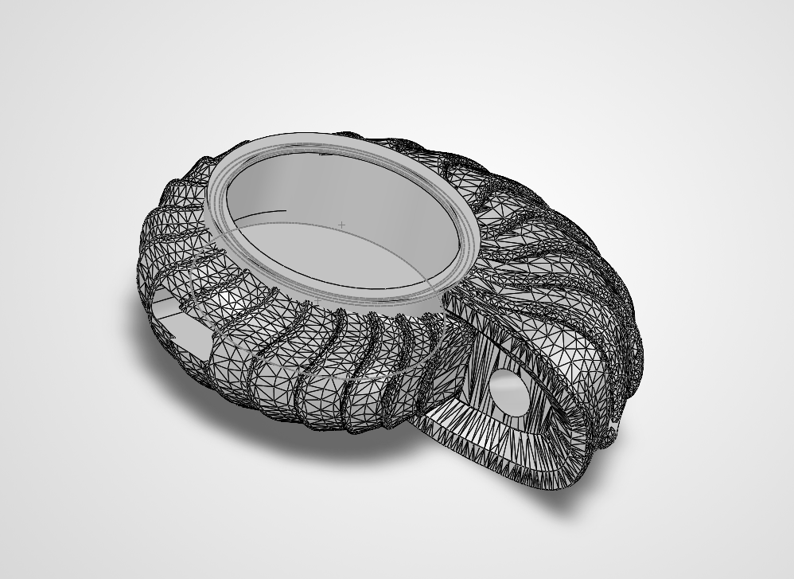

# LIQUILITE

> **Sponsorship Notice**  
>   
> This project was designed and generously sponsored by **[EasyEDA](https://easyeda.com/)**. You can explore and fork the interactive hardware design directly on [OSHWLab](https://oshwlab.com/ezekielchang31/project_aiwnxyiw).

---

## About the Project

**LIQUILITE** is an open-source hardware and firmware project built around the **STM32L412** microcontroller. It is a pendant with an LED matrix that displays a real-time fluid simulation.

---

## Full Demo

https://github.com/user-attachments/assets/YOUR-VIDEO-ID

[Watch the full demo (download)](media/full_demo.mp4)

---

## Gallery

<table>
  <tr>
    <td align="center"> Amber</td>
    <td align="center"> Amber</td>
    <td align="center"> Amber</td>
  </tr>
  <tr>
    <td align="center"> Aqua</td>
    <td align="center" colspan="2"> Enclosure</td>
  </tr>
</table>

---

## Repository Structure

* **`ProDoc_liquilite_.epro2`**: Complete EasyEDA Pro PCB design and schematic file.
* **`liquilite.ioc`**: STM32CubeMX project configuration file.
* **`Core/` & `Drivers/`**: STM32 firmware source code and HAL drivers.
* **`media/`**: Photos, renders, and demo video.

## Hardware & Design

* **EDA Tool:** [EasyEDA Pro](https://pro.easyeda.com/)
* **MCU:** STM32L412CBTX
* **OSHWLab Project Page:** [LIQUILITE on OSHWLab](https://oshwlab.com/ezekielchang31/project_aiwnxyiw)

### How to View the Design

1. Download or open [EasyEDA Pro](https://pro.easyeda.com/).
2. Select **File** > **Open** > **EasyEDA File** and select `ProDoc_liquilite_.epro2`.
3. Alternatively, view, fork, or order PCBs directly through the [OSHWLab Project Page](https://oshwlab.com/ezekielchang31/project_aiwnxyiw).

---

## Credits & Acknowledgments

* **[Mitxela](https://mitxela.com/)**: Original project concept and inspiration.
* **Mathias Müller**: Mathematical principles and underlying calculations.
* **[EasyEDA](https://easyeda.com/)**: Sponsoring the PCB design, manufacturing, and prototyping for this project.
